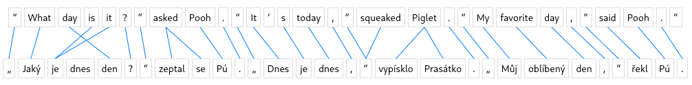

# Word Alignment Visualization



## Overview

Word Alignment Visualization is a Python package designed to facilitate the visual exploration of word alignments between two sentences. The package provides an interactive widget that displays original and translated sentences with word alignment lines.

## Features

- Dynamic visualization of word alignments.
- Hover effects for highlighting word pairs and alignment lines.
- Easy integration into Jupyter notebooks.

## Usage

```python
from word_alignment_visualization import show_word_alignments

# Example data
src_tokens = ["I", "love", "coding"]
tgt_tokens = ["J'aime", "coder"]
alignment = [[0, 0], [1, 0], [2, 1]]

# Display word alignment visualization
show_word_alignments(src_tokens, tgt_tokens, alignment)
```

## Installation

```bash
pip install word-alignment-visualization
```

## Contributions

Contributions are welcome! If you have ideas for improvements, new features, or bug fixes, feel free to open an issue or submit a pull request.

## License

This project is licensed under the [GNU GPLv3  License](link_to_license).
